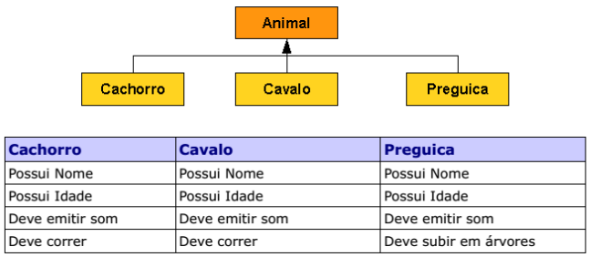

# Tarefa 012 - Polimorfismo - 27/08/2021

1. Crie uma hierarquia de classes conforme abaixo com os seguintes atributos e comportamentos (observe a tabela), utilize os seus conhecimentos e distribua as características de forma que tudo o que for comum a todos os animais fique na classe Animal:

  

2. Implemente uma classe de teste, **AnimalTeste** que crie os 3 tipos de animais definidos no exercício anterior e invoque o método que emite o som de cada um de forma polimórfica, isto é, independente do tipo de animal.

3. Implemente uma classe **Veterinario** que contenha um método **examinar()** cujo parâmetro de entrada é um Animal, quando o animal for examinado ele deve emitir um som, passe os 3 animais com parâmetro.

4. Crie uma classe Zoologico, com 10 jaulas (utilize um array) coloque em cada jaula um animal diferente, percorra cada jaula e emita o som e, se o tipo de animal possuir o comportamento, faça-o correr.

5. Resolva a seguinte situação utilizando os conceitos aprendidos. Uma empresa quer manter o registro da vida acadêmica de todos os funcionários, o modelo deve contemplar o registro das seguintes informações, de forma incremental:
    5.1. Para o funcionário que não estudou, apenas o nome e o código funcional;
    5.2. Para o funcionário que concluiu o ensino básico, a escola;
    5.3. Para o funcionário que concluiu o ensino médio, a escola;
    5.4. Para o funcionário que concluiu a graduação, a Universidade;

6. Estenda o modelo implementado no exercício anterior de forma que todo funcionário possua uma renda básica de R$ 1000,00 e:
    6.1. Com a conclusão do ensino básico a renda total é renda básica acrescentada em 10%;
    6.2. Com a conclusão do ensino médio a renda total é a renda do nível anterior acrescentada em 50%;
    6.3. Com a conclusão da graduação a renda total é a renda do nível anterior acrescentada em 100%;
    6.4. Todos os cálculos são efetuados sempre sobre a última renda obtida.

7. Crie um programa que simule uma empresa com 10 funcionários, utilize um array, sendo que a escolaridade dos funcionários é distribuída da seguinte forma: 40% ensino básico, 40% ensino médio e 20% nível superior. Calcule os custos da empresa com salários totais e por nível de escolaridade, utilize a classe funcionário desenvolvida no exercício anterior.

8. Faça uma hierarquia de Comissões, crie as comissões de Gerente, Vendedor e Supervisor. Cada uma das comissões fornece um adicional ao salário conforme abaixo:
    8.1. Gerente: R$1500,00
    8.2. Supervisor: R$600,00
    8.3. Vendedor: R$250,00

9. Adicione a classe funcionário um atributo referente as comissões desenvolvidas no exercício anterior. Corrija o método renda total de forma que ele some ao valor da renda calculada o adicional da comissão do funcionário.

10. Refaça o exercício 7 considerando que 10% dos funcionários são Gerentes, 20% são supervisores e 70% são vendedores.

11. Sobreescreva o método toString de forma que ele imprima o nome do funcionário, a comissão e o salário total. Imprima todos os funcionários da empresa criada no exercício 7.

12. Definir pacotes para manter o código de cada exercício, sendo que o que estará na raiz do projeto deverá se chamar tarefa013, outros podem ser criados dentro deste. Classes utilizadas em um exercício podem ser aproveitadas em outros exercícios.

**INSTRUÇÕES**
1. O uso de orientação a objetos e pre-requisito para esta implementação;
2. A linguagem de programação pode ser a da preferência do aluno;
3. A entrega deve ser feita no seu repositório pessoal, utilizado para a disciplina.
4. Não devem ser commitados os arquivos de configuração local, arquivos compilados, etc. Estes devem estar adicionados ao arquivo '.gitignore'.
5. O prazo para entrega desta tarefa é as 23h59min do dia 29/08/2021.
